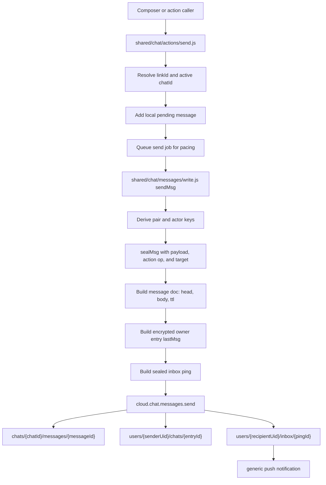
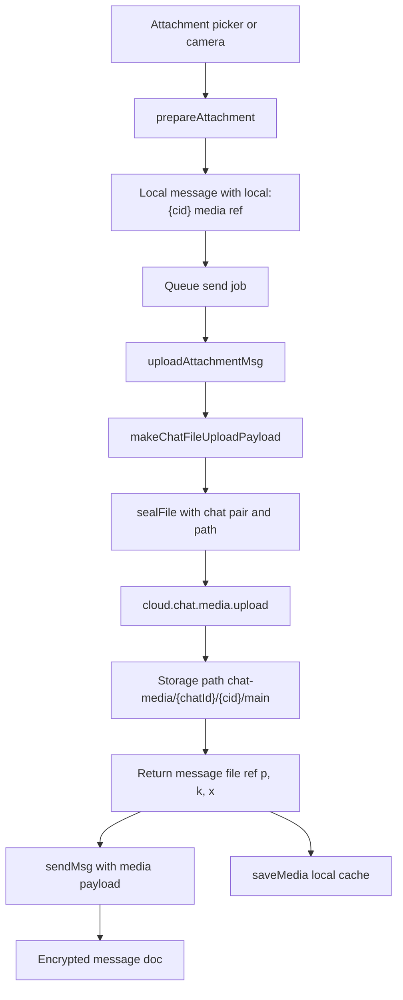
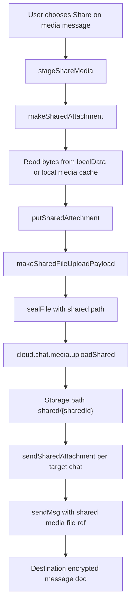
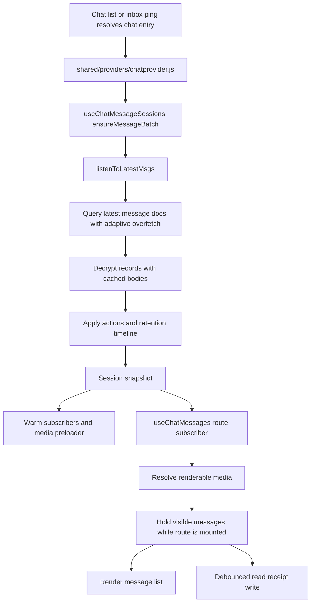
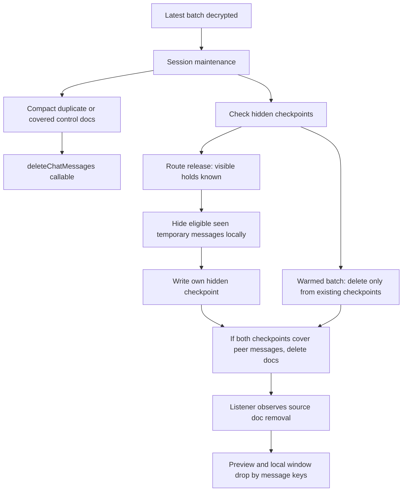

# Chat Message Flow

Use this guide when changing message send, receive, media, sharing, loading, retention, read receipts, hidden checkpoints, or compaction. The canonical lifecycle rules remain in [chat.md](chat.md); this file is the end-to-end flow map.

## Text And Request Sends

Text messages, payment requests, edits, reactions, receipts, hidden checkpoints, and retention system messages all become signed encrypted chat actions before they hit Firestore.

Ownership:

- Local echo and retry state: `shared/chat/actions/send.js`.
- Encryption, owner-entry write payload, inbox ping, deletes, edits, controls: `shared/chat/messages/write.js`.
- Pair, link, actor validation: `shared/chat/pairs.js`, `shared/crypto/chat.js`, `shared/chat/messages/actions.js`.
- Backend callable envelope: `cloud.chat.messages.send`; the backend stores opaque message data and sealed pings.

## Chat Media Sends

Chat media is encrypted as file bytes first, uploaded under the active chat, then referenced from the normal encrypted message action.

Important details:

- The message `cid` is the media message key and the Storage path segment.
- The message body contains the encrypted media file ref, key, metadata, and retention mode.
- The file bytes are encrypted before upload; Storage never receives plaintext media.
- Saving a chat media message sets the shared message doc `ttl` to `null` and projects a Storage hold through `setChatMessageTtl`.

## Shared Media Sends

Shared media is a new expiring shared object. Destination chats reference the shared object; they do not reference the source chat id or source chat media path.

Shared-media constraints:

- Shared media messages cannot be saved forever.
- Deleting the destination message does not delete `shared/{sharedId}`.
- The destination message remains opaque to the backend and only carries the shared file ref inside the encrypted body.

## Receive And Load

Opening or warming a chat uses the same session batch owner. The route hook renders from the session; it does not own Firestore message cleanup.

Loading owners:

- Latest batch watch, warm state, media preloads, compaction, and after-seen delete checks: `shared/chat/messages/session/`.
- Route windowing, older-page loading, visible-message holds, reply jumps, and renderable media resolution: `shared/chat/usemessages.js`.
- List previews, hidden preview keys, and chat-list cache: `shared/chat/usechatlist.js`.

## Maintenance

Maintenance is client-owned because only clients can decrypt the stream and understand message semantics.

Rules:

- Control compaction can run on any ready latest batch because it removes redundant controls, not user-visible display messages.
- Do not compact read receipts broadly. Older receipt timestamps are the first-seen clock for `24h after seen`.
- Saved messages are not protected by a route keep-list. They are protected because the shared message doc is permanent (`ttl: null`), which makes them ineligible for after-seen hide/delete cleanup until unsaved.
- Warmed batches may delete temporary display docs only when both participants' hidden checkpoints already exist.
- The opened route hides eligible seen temporary messages and writes this client's hidden checkpoint only on release, after current visible-message holds are known.
- Physical delete remains the source-of-truth removal signal. There are no delete tombstone action docs.

## Adding A Message Feature

Use the narrowest owner:

- New plaintext-rendered payload type: add type helpers, compose support, send payload support, renderer support, and action validation.
- New chat-visible mutation: add a signed action op and target validation; do not rewrite source payloads when an append-only action can describe the fact.
- New owner-private state: put it under owner records or route/provider state, not chat-stream controls.
- New shared retention state: use the existing message TTL path only when the product fact is global to the shared message, as with saved v1.
- New media behavior: keep byte encryption and upload reservations in file/media helpers, then reference the file from the encrypted message body.
- New loading or cleanup behavior: start in `shared/chat/messages/session/` if it affects warmed/latest batches; start in `shared/chat/usemessages.js` only if it depends on the mounted route, older-page route state, or visible-message holds.
