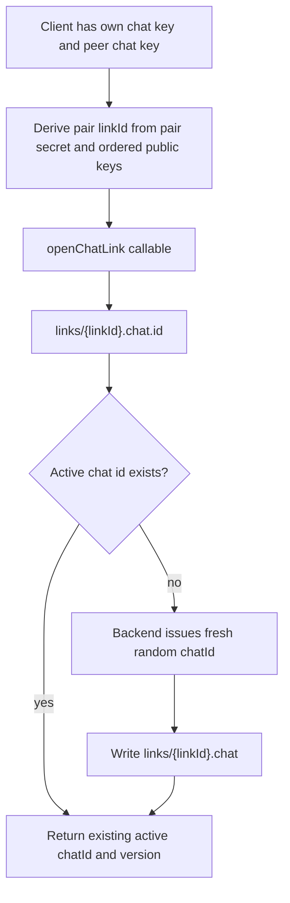
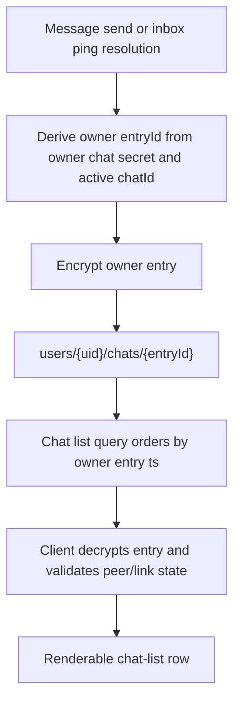
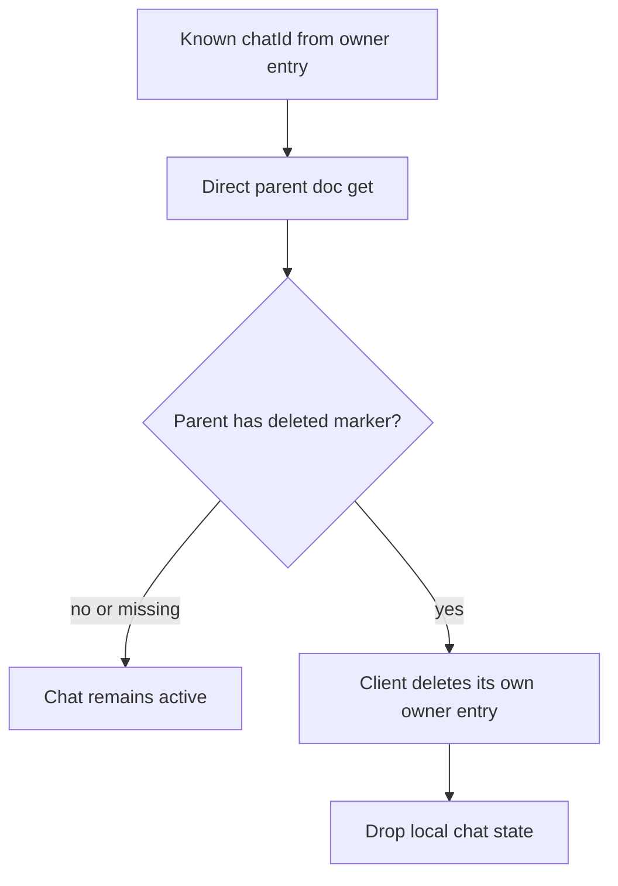
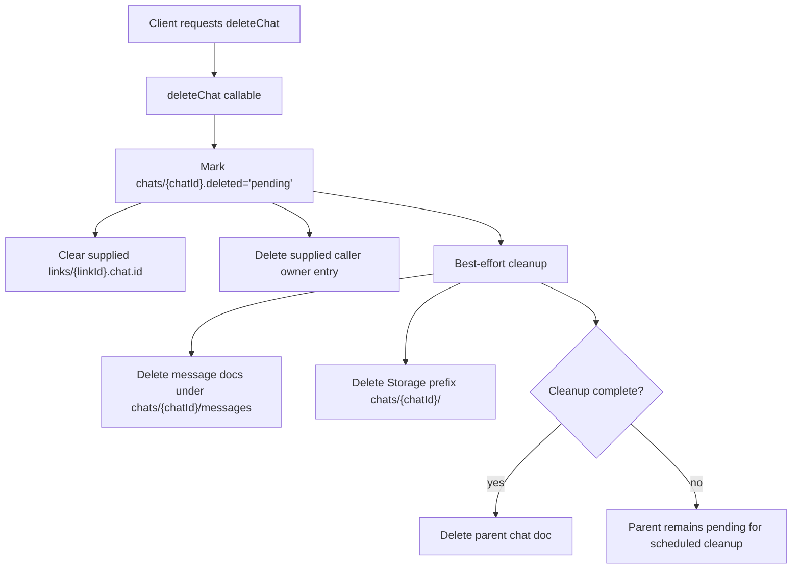
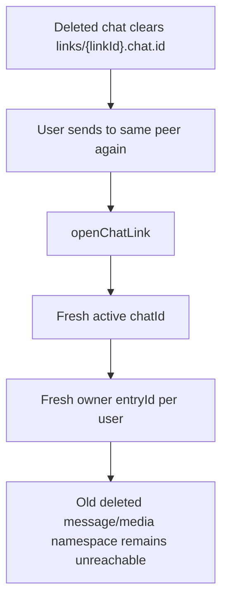

# Chat Lifecycle

Use this guide when changing chat creation, link state, owner entries, delete markers, whole-chat delete, chat recreation, or chat-list availability checks. Secret derivation lives in [secrets.md](secrets.md), message behavior lives in [msg.md](msg.md), message batch loading lives in [batches.md](batches.md), and account cleanup lives in [user.md](user.md).

## Instance Creation

Chats are active instances behind a stable pair-derived link. The pair link lets a deleted chat be recreated with the same peer while getting a fresh active `chatId`.

The server can see `linkId` and active `chatId`, but not the plaintext participants from the parent chat document. `linkId` is only the rendezvous id; message roots and actor keys are scoped by the active `chatId`. Clients verify pair ownership after decrypting owner entries and inbox pings.

## Owner Entries

The canonical chat-list source is owner-private.

Owner entry `ts` plus `entryId` is the plaintext owner-visible list marker. It is not canonical message order; clients repair stale previews after decrypting pings/actions.

## Parent Chat Docs

Parent `chats/{chatId}` docs are not app state. Missing parent docs are normal active chats. A parent doc exists only as a server kill marker during and after whole-chat delete.

Do not add participants, sender keys, previews, settings, read state, reaction state, retention state, active-route state, or list ordering fields to parent chat docs.

## Whole-Chat Delete

Whole-chat delete is rare private-data cleanup. It intentionally uses a callable because it must mark the opaque shared chat unavailable before physical cleanup and clear supplied owner/link state.

The delete marker stores no participant ids. If the other participant still has an encrypted owner entry, their client deletes only its own owner entry when direct parent-doc resolution proves the shared chat is unavailable.

## Recreation

After whole-chat delete, a new send to the same peer can reuse the pair-derived `linkId` while receiving a fresh active `chatId`.

## Ownership

- Pair link open/recreation: `functions/chat/links.js`, `shared/chat/pairs.js`.
- Whole-chat delete and scheduled cleanup: `functions/chat/deletechat.js`.
- Client delete/account-delete orchestration: `shared/chat/actions/delete.js`, `shared/providers/chatprovider.js`.
- Owner entry crypto: `shared/chat/entry.js`.
- Chat-list filtering: `shared/chat/list.js`, `shared/cloud/firebase.js`.
