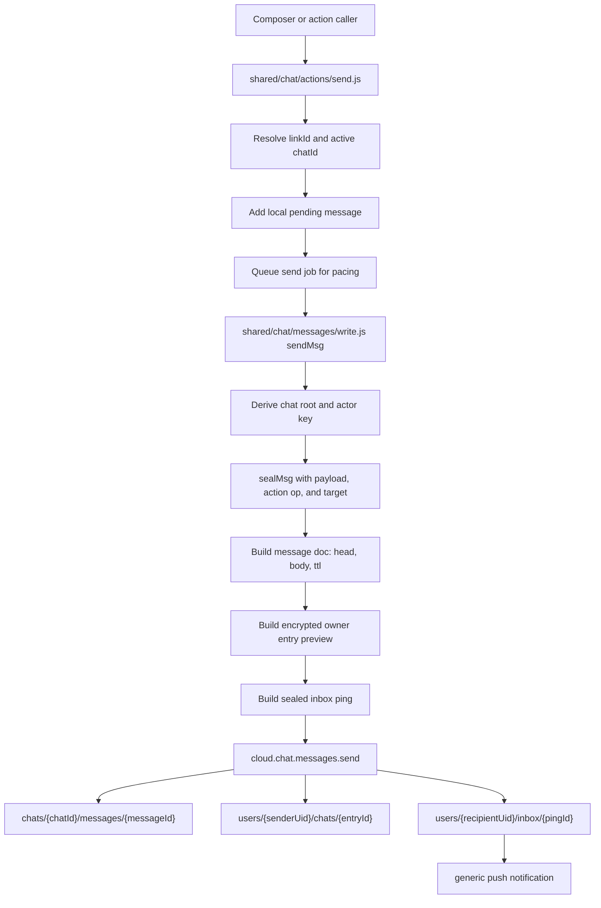
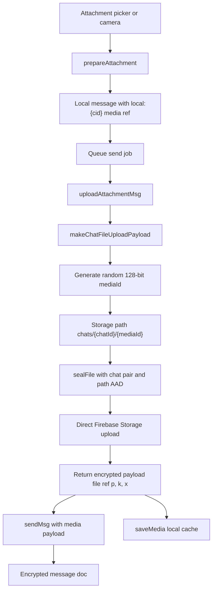
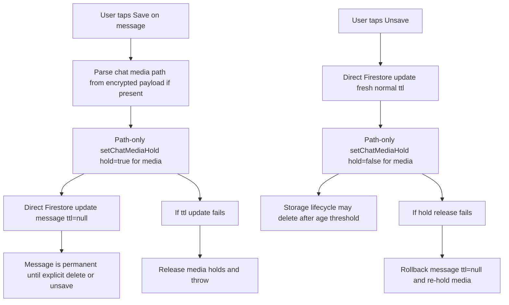
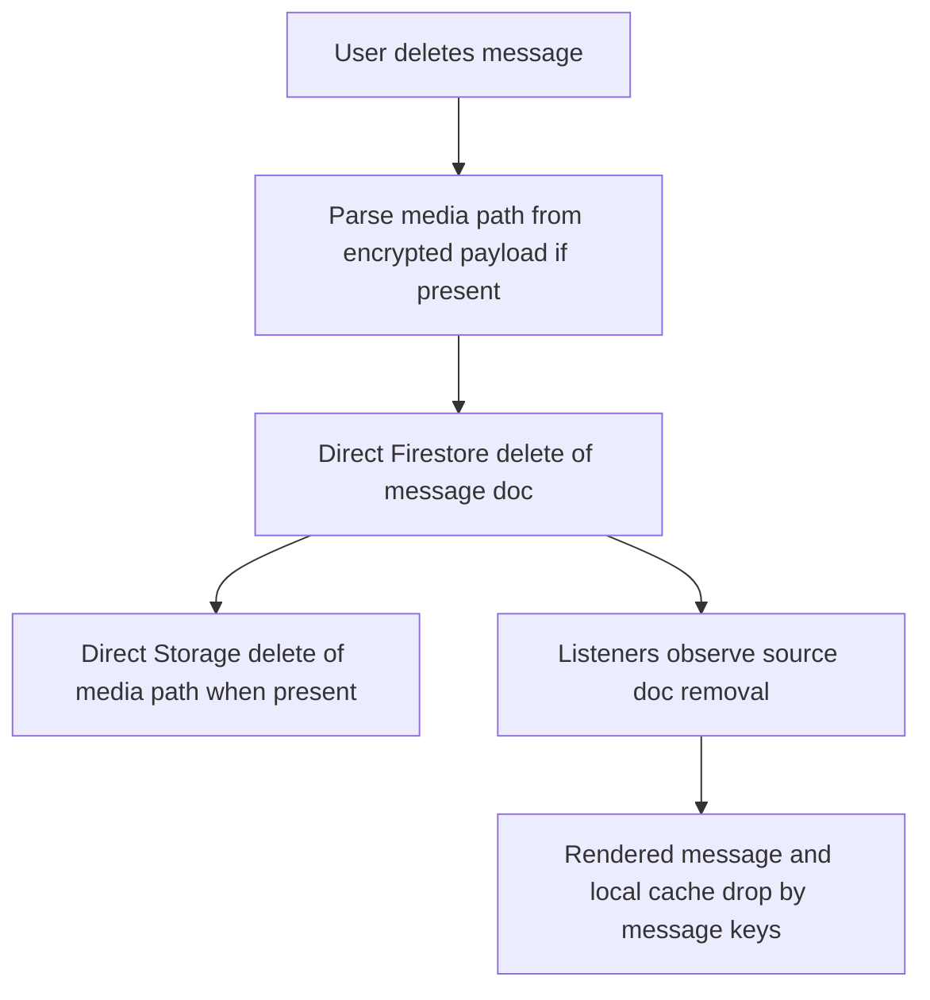
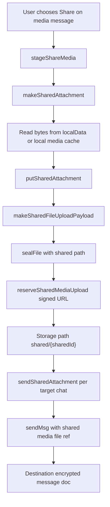

# Message Lifecycle

Use this guide when changing message send, media upload, edits, reactions, receipts, save/unsave, explicit message delete, shared media, or message TTL behavior. Secret derivation lives in [secrets.md](secrets.md), chat instance lifecycle lives in [chat.md](chat.md), route batch behavior lives in [batches.md](batches.md), and user/account cleanup lives in [user.md](user.md).

## Send

Text messages, payment requests, edits, reactions, read receipts, hidden checkpoints, and retention system messages become signed encrypted chat actions before they hit Firestore.

Message docs carry only `{ head, body, ts, ttl }`. `head.cid` is an opaque client id used for ordering, retry, and action targeting. Sender identity, payload type, actor key, action op, action target, read state, reactions, retention mode, media path, media key, captions, filenames, and payment facts live inside the encrypted body.

Visible delivery messages write the sender owner-entry preview and sealed recipient inbox ping. Read receipts, reactions, and hidden checkpoints are stream-only controls: they write only the encrypted message action doc plus the Firestore rules deletion-gate read. Loaded clients can still derive peer-useful chat-list preview text such as "has seen your message" or "liked your message" from those controls after the message stream is warmed or opened, but a user's own read receipt does not replace the message they just read in their preview.

Display creates get a normal 21-day `ttl`. Durable action docs use `ttl: null`. Firestore TTL is dumb server cleanup; it must not be shortened because a read receipt arrived.

## Chat Media

Chat media is encrypted as file bytes first, uploaded under the active chat, then referenced from the encrypted message payload.

Rules:

- The media object path is `chats/{chatId}/{mediaId}`.
- `mediaId` is fresh 128-bit random hex generated by the client and stored only inside the encrypted media payload path.
- `cid` is not the media object id.
- Chat media uploads go directly through Firebase Storage rules, not through a chat media upload callable.
- Storage object metadata uses `application/octet-stream`; the user-facing MIME type stays inside the encrypted payload.
- The encrypted local media cache stores only vault-encrypted blobs with opaque local ids.

## Save And Unsave

Saving is a shared message fact, not owner-private state. Any participant can save or unsave a message; the newest successful toggle defines shared retention.

Save/unsave mechanics:

- Message save updates only `ttl`, guarded by Firestore rules that allow only `ttl` changes.
- `ttl: null` means saved/permanent.
- Unsave sets a fresh normal unsaved TTL, currently 21 days from the toggle.
- Chat media save projects to Cloud Storage object metadata `temporaryHold: true`.
- The hold endpoint receives only `{ path, hold }` and does not receive Firebase auth.
- Whole-chat delete and explicit message delete still remove saved media.

## Delete

Explicit message delete is a source-doc delete. There are no normal delete tombstone action docs.

Either participant may hard-delete any shared message by knowing the opaque `chatId`. The server does not verify participant identity. Client renderers treat the removed source doc as the delete signal.

## Shared Media

Shared media is a separate expiring object. Destination messages reference the shared object; they do not reference the source chat id or source chat media path.

Shared media constraints:

- Shared media messages cannot be saved forever.
- Deleting the destination message does not delete `shared/{sharedId}`.
- Shared media still uses the signed upload URL path because it is not chat-scoped.

## Ownership

- Local echo and retry state: `shared/chat/actions/send.js`.
- Encryption, owner-entry write payload, inbox ping, deletes, edits, controls, save/unsave items: `shared/chat/messages/write.js`.
- Media payload/path helpers: `shared/chat/filepayload.js`, `shared/files.js`, platform media adapters.
- Direct cloud transport: `shared/cloud/firebase.js`.
- Storage hold endpoint and shared-media upload signer: `functions/chat/media.js`.
