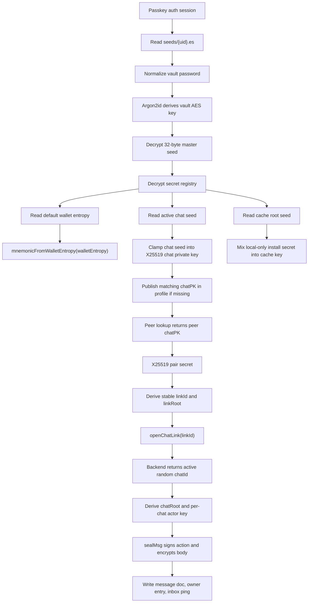
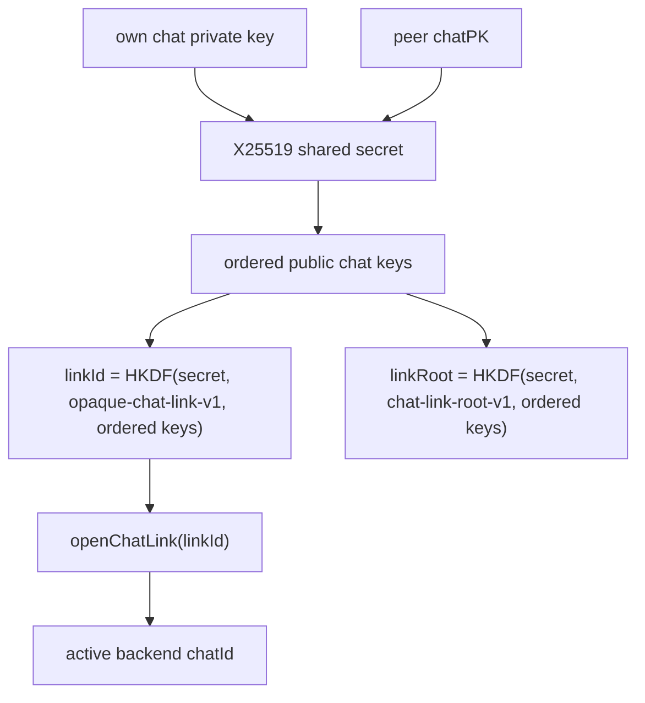
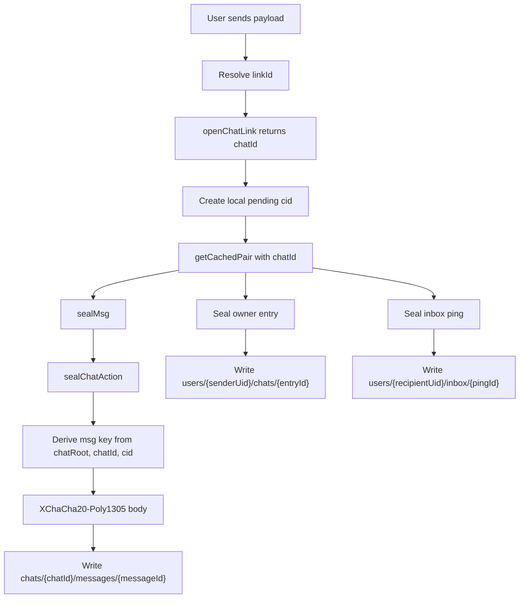

# Secret Lifecycle

Use this guide when changing vault unlock, seed derivation, chat key derivation, pair links, active chat ids, message encryption, action signatures, owner entries, inbox pings, or secret cleanup. Chat instance behavior lives in [chat.md](chat.md), message writes live in [msg.md](msg.md), route batch behavior lives in [batches.md](batches.md), and account cleanup lives in [user.md](user.md).

## Invariants

- The vault password, decrypted master seed, secret registry, wallet mnemonic entropy, chat private key, pair secret, chat roots, actor secrets, owner-entry keys, ping keys, message keys, local cache keys, and file keys stay client-side.
- The master seed unwraps the encrypted feature secret registry. Wallet, chat, and cache features use registry-owned secrets instead of direct master-seed children.
- `linkId` is a stable pair rendezvous id. It is used to open or recreate the backend chat instance at `links/{linkId}`.
- `linkId` is not a message/action encryption root input. Message bodies, action authenticators, and actor signatures are scoped by active `chatId`.
- A recreated chat gets a fresh backend-issued `chatId`, fresh owner entry ids, fresh chat roots, fresh actor keys, and fresh message keys while keeping the same pair `linkId`.
- Crypto readers are single-stream. Changing body envelope versions, KDF labels, or key schedules intentionally makes older ciphertext unreadable unless a migration is explicitly approved.

## Full Flow

## Vault Creation

On onboarding, web and iOS create the same seed envelope:

1. `encryptSeed(password)` in the platform seed module calls shared `encryptSeed`.
2. Shared `generateSeed()` creates a random 32-byte master seed.
3. The platform Argon2id implementation derives a 32-byte vault key from the normalized vault password and a random salt.
4. Shared AES sealing encrypts the master seed.
5. A fresh secret registry is created with random BIP39 entropy for the default wallet plus independent random seeds for the active chat identity and local cache root.
6. The registry is encrypted with `HKDF(masterSeed, 'secret-registry-wrap-v1')`.
7. `packSeedData(...)` stores the crypto marker, KDF params, salt, AES IV, master-seed ciphertext, and encrypted registry in one byte blob.
8. `cloud.user.vault.write(uid, vault)` writes that byte blob to `seeds/{uid}.es`.

The plaintext master seed is zeroed after encryption. Glyphteck stores only the packed encrypted seed blob.

## Vault Unlock

Unlock reverses vault creation locally:

1. The vault provider reads `seeds/{uid}.es` through `cloud.user.vault.read` or `watch`.
2. `unpackSeedData(vault)` extracts KDF params, salt, IV, master-seed ciphertext, and the encrypted registry.
3. The entered password is normalized with `normalizePassword`.
4. The platform Argon2id implementation derives the vault AES key.
5. `decryptSeed(...)` opens the encrypted seed and returns the 32-byte master seed.
6. The provider decrypts the secret registry with a master-derived registry wrapping key.
7. The provider reads the default wallet entropy, active chat seed, and cache root seed from the registry, then zeroes the master seed.

The platform difference is only the Argon2id implementation: web uses a worker, iOS uses `react-native-argon2`. The shared seed envelope and derivation labels are the same.

## Secret Registry

The master seed is only the vault root. It decrypts the feature secret registry and should not be used as a direct feature seed.

- Wallet: the default wallet stores random 16-byte BIP39 entropy in a `bip39-entropy-v1` registry entry. `mnemonicFromWalletEntropy(walletEntropy)` produces the mnemonic used to boot Spark. The Spark identity public key is written with `setWalletPK` if the profile is missing it for the active network.
- Chat: the active chat identity has an independent random registry seed. `getKeyPair(chatSeed)` turns it into the X25519 chat keypair. The public key is hex-encoded as `chatPK` and written with `setChatPK` if the profile is missing it.
- Local cache: the registry contains a random cache root seed. Each device mixes that seed with a local-only install secret before opening the vaulted local cache.

`bootChat` zeroes the chat seed after creating the X25519 keypair. The live chat private key remains in the vault provider only while the vault is unlocked.

The registry is the layer that lets Veyl add more wallets, rotate a chat identity, or add new secret-backed features without changing the master seed or changing unrelated feature seeds.

## Vault Migration

Normal unlock supports only the current vault envelope. Older envelopes are handled by an explicit unlock-time migration phase:

1. `unpackSeedData(vault)` rejects the old envelope and the provider moves to `migrating`.
2. The migration adapter decrypts the old envelope locally with the entered password.
3. The adapter extracts canonical secrets such as wallet entropy and chat seed.
4. The client verifies the derived wallet and chat identities against the current profile by booting the wallet/chat paths before replacement.
5. The client builds a fresh current vault envelope with a normal encrypted registry.
6. `replaceVault` replaces `seeds/{uid}.es` only if the current stored vault hash still matches the bytes the client migrated from.

The replacement writes only the current `es` blob. There is no migration marker and no alternate unlock path after migration.

## Local Cache Device Secret

The local cache key has two inputs:

1. The cache root seed from the encrypted secret registry.
2. A random local install secret that is created on that device only.

Web stores the install secret in the local IndexedDB cache database. iOS stores it in Secure Store with `WHEN_PASSCODE_SET_THIS_DEVICE_ONLY`. The install secret is never uploaded, so the backend does not learn a device id, device count, hardware model, or stable per-device identifier from this cache-key layer.

If the local install secret is lost, the device's local cache becomes unreadable and starts fresh. That is acceptable because the local cache is only an optimization; the server remains the source of truth for messages and wallet balance.

## Pair And Link

For a peer chat, each side starts with its own live chat private key and the peer's public `chatPK`.

`linkId` is deterministic for the pair and does not change when the chat is deleted and recreated. The backend stores active instance state at `links/{linkId}.chat`. It can return an existing active `chatId` or issue a fresh random 32-byte hex `chatId`.

`linkRoot` is separate from the message root. It proves a sealed inbox ping belongs to the pair link, but it is not used to encrypt message bodies or authenticate chat actions.

## Chat Instance Keys

Once an active `chatId` exists, `openPair(..., { chatId })` derives chat-instance material:

- `chatRoot = HKDF(pairSecret, 'chat-root-v1', [chatId, ...orderedChatKeys])`.
- `actorSecret = HKDF(chatPrivateKey, 'chat-actor-sign-v1', [chatId, ...orderedChatKeys])`.
- `actorPK = ed25519.getPublicKey(actorSecret)`.

Message and action crypto uses `chatRoot`, not `linkId`. Actor signatures use the local chat private key plus `chatId`, so the same two users get different actor keys after chat recreation.

Opening a pair without `chatId` is link-only. It can return `linkId` and `linkRoot`, but it cannot produce message keys, action roots, or actor keys.

## Sending A Message

The send path starts at `shared/chat/actions/send.js` and writes through `shared/chat/messages/write.js`.

Concrete send steps:

1. `resolvePeerChat` derives or reuses `linkId`, calls `cloud.chat.links.open(linkId)`, and receives the active `chatId`.
2. `sendMsg` requires `chatId`, opens the cached pair, and checks any supplied `linkId` against the derived `pair.linkId`.
3. `sealMsg` builds `head = { cid }`.
4. `sealChatAction` wraps the plaintext payload in an action envelope containing version, op, chat, id, target, actor, timestamp, payload, and either a signature or an authenticator.
5. Normal sends use the per-chat Ed25519 actor signature. HMAC action auth, when requested by an action path, uses `chatRoot`.
6. The message key is `HKDF(chatRoot, 'msg-body', [chatId, cid])`.
7. The message AAD is `encodeScope('msg-body', [chatId, cid])`.
8. The action envelope is JSON-encrypted with XChaCha20-Poly1305 and packed with the current body envelope version.
9. Firestore receives only `{ head, body, ttlMs }` for `chats/{chatId}/messages/{messageId}`. Server timestamps and TTL fields are added by the cloud adapter and rules path.

`head.cid` is opaque. Sender key, action type, action target, payload type, text, payment request details, reaction, read receipt, media path, media key, captions, and filenames stay inside `body`.

## Owner Entry

The sender's list row is owner-private:

1. `entryId = HKDF(chatPrivateKey, 'user-chat-entry-id-v1', [chatId], 16)` as hex.
2. `entryKey = HKDF(chatPrivateKey, 'user-chat-entry-v1', [entryId])`.
3. `makeOwnChatEntry` includes `linkId`, `chatId`, `peerChatPK`, peer uid if known, pinned actor keys, settings, preview, saved state, and read timestamp.
4. `sealOwnChatEntry` encrypts the entry JSON with `entryKey` and entry AAD.
5. The cloud adapter writes `users/{uid}/chats/{entryId}` with encrypted `body` and plaintext owner query timestamp.

The owner entry is the chat-list source. It is not a server-readable participant record.

## Inbox Ping

The recipient learns about a message through a sealed ping:

1. The sender generates an ephemeral X25519 keypair.
2. The ping key is `HKDF(ephemeralSharedSecret, 'chat-inbox-ping-v1', [epk, recipientChatPK])`.
3. The encrypted ping payload includes version, kind, `linkId`, `chatId`, sender `chatPK`, sender uid, sender actor public key, message id, and timestamp.
4. The ping proof is `HMAC(linkRoot, canonicalPingInput(payload))`.
5. The sealed ping writes to `users/{recipientUid}/inbox/{pingId}` and may trigger a generic push notification.

The ping includes `linkId` because the recipient uses it to verify the pair link before trusting the active `chatId`. It does not use `linkId` as the message/action root.

## Receiving A Message

On inbox processing or message batch loading:

1. The recipient decrypts the ping with its chat private key and the ping ephemeral public key.
2. The recipient derives the link-only pair, checks `payload.linkId`, and verifies the ping proof with `linkRoot`.
3. The recipient opens the chat pair with `payload.chatId`, deriving the same `chatRoot` and its own per-chat actor key.
4. The recipient reads the pointed message doc or latest message batch.
5. `openMsg` derives the same message key from `chatRoot`, `chatId`, and `cid`, decrypts the body, checks the action chat target, verifies the actor signature or chat-root authenticator, and returns the plaintext action payload.
6. Client reductions apply read receipts, reactions, edits, hidden checkpoints, retention, and display filters after decryption.
7. The recipient writes or updates its own encrypted owner entry and deletes processed inbox pings.

Any message body, ping, owner entry, or action that fails these checks is ignored.

## Attachments

Chat attachment bytes use a separate random file key:

1. The client creates a fresh random 128-bit `mediaId` and stores bytes at `chats/{chatId}/{mediaId}`.
2. The client creates a random 32-byte file key.
3. Attachment bytes are AES-GCM encrypted with AAD bound to the Storage path.
4. The encrypted message payload stores the Storage path, encoded file key, expiry timestamp, and user-facing metadata.

The file key is protected by the message body encryption. The Storage object path and encrypted blob alone are not enough to decrypt the attachment.

## What The Server Sees

The server can see:

- Firebase auth uid for authenticated calls.
- `seeds/{uid}.es` encrypted seed blob, including the encrypted secret registry.
- Public profile fields such as username, avatar marker, wallet public key, and `chatPK`.
- Pair `linkId` when a client opens or deletes a link.
- Active random `chatId`, message doc ids, `head.cid`, ciphertext bodies, timestamps, TTL fields, and chat media paths.
- Owner entry ids and owner entry timestamps under a user's path.
- Inbox ping ids, ping ephemeral public keys, encrypted ping bodies, sender auth uid, and recipient uid for push routing.

The server should not see:

- Vault password, decrypted master seed, decrypted secret registry, wallet entropy, wallet mnemonic, wallet private keys, chat private keys, cache root seed, device cache secret, pair secret, chat roots, actor secrets, owner-entry keys, ping keys, message keys, or file keys.
- Plaintext message content, payment request details, sender identity inside a message body, read receipts, reactions, edits, hidden checkpoints, retention mode, previews, captions, filenames, peer lists, or chat-list semantics.

## Lock And Cleanup

Vault lock, failed unlock, auth switch, provider unmount, and account deletion must tear down live secrets:

- Close Spark wallet connections.
- Zero the live chat private key where possible.
- Clear cached chat pairs, which zero `linkRoot`, `chatRoot`, and actor secrets.
- Close the vaulted local cache handle, which zeroes the device-mixed cache key.
- Clear provider-owned plaintext chat, peer, message, and preview state.

## Ownership

- Seed envelope, secret registry, and derivation labels: `shared/crypto/seed.js`, `shared/crypto/pack.js`.
- Platform vault KDF: `apps/web/src/lib/crypto/kdf.js`, `apps/ios/src/lib/crypto/kdf.js`.
- Vault boot and lock: `shared/vault.js`, platform vault providers.
- Local cache device secret: `apps/web/src/lib/cache/localdata.js`, `apps/ios/src/lib/cache/localdata.js`.
- Pair, link, chat root, and message key derivation: `shared/crypto/pair.js`, `shared/crypto/chat.js`.
- Actor key derivation and signatures: `shared/crypto/sign.js`, `shared/chat/messages/actions.js`.
- Owner entries: `shared/chat/entry.js`.
- Inbox pings: `shared/chat/ping.js`.
- Message sends and controls: `shared/chat/messages/write.js`, `shared/chat/actions/*`.
- Link creation and recreation: `functions/chat/links.js`.
