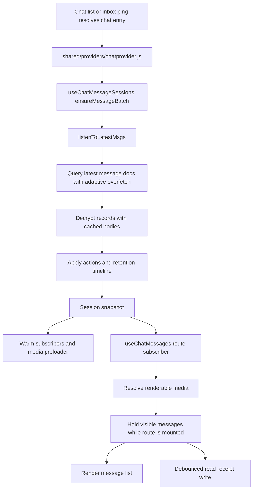
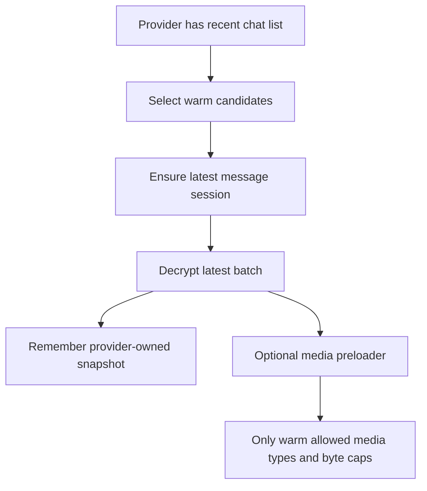
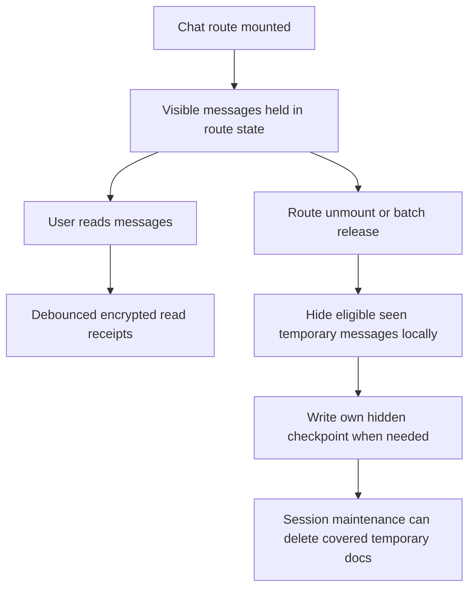
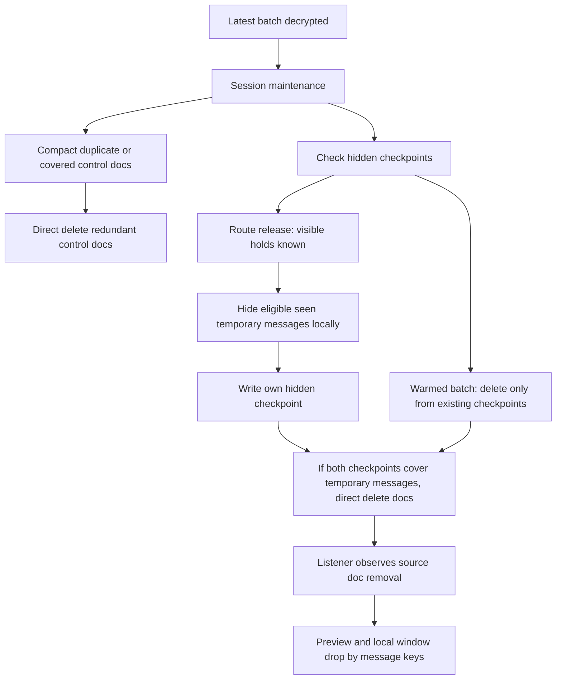

# Session Lifecycle

Use this guide when changing chat-list warming, latest-message batches, route message loading, media preloading, retention application, read receipts, hidden checkpoints, or compaction. Message write/delete/save behavior lives in [msg.md](msg.md), chat instance behavior lives in [chat.md](chat.md), and account cleanup lives in [user.md](user.md).

## Latest Batch And Route Open

Opening or warming a chat uses the same provider-owned session batch. The route consumes the session and owns only route-specific older paging and visible-message holds.

Session state is memory-only after unlock. Do not persist message lists to durable local cache, and do not use Firebase offline persistence as a substitute for vaulted cache.

## Warming

Warming is a session optimization, not durable state.

Warm sessions may decrypt message docs and run safe maintenance, but they must not:

- write this client's hidden checkpoint
- infer route visibility
- persist message lists
- download attachment bytes outside explicit warm media policy

## Route Release

The opened route owns current visible-message holds. Hidden-checkpoint writes wait until route release because only the route knows which messages were visible and held.

`on seen` hides after route release. `24h after seen` hides after the first covering receipt is 24 hours old. Saved messages are protected by `ttl: null`, not by route holds.

## Maintenance

Maintenance is client-owned because only clients can decrypt the stream and understand message semantics.

Rules:

- Control compaction can run on any ready latest batch because it removes redundant controls, not user-visible display messages.
- Do not compact read receipts broadly; older receipt timestamps are the first-seen clock for `24h after seen`.
- Warmed batches may delete temporary display docs only when both participants' hidden checkpoints already exist.
- The opened route writes this client's hidden checkpoint only on release.
- Physical delete remains the source-of-truth removal signal.

## Ownership

- Provider/session owner: `shared/providers/chatprovider.js`, `shared/chat/messages/session/`.
- Latest query/decrypt projection: `shared/chat/messages/query.js`.
- Route subscriber/windowing/older pages: `shared/chat/usemessages.js`, `shared/chat/messages/window.js`.
- Retention and hidden/read action helpers: `shared/chat/messages/control.js`, `shared/chat/read.js`, `shared/chat/ttl.js`.
- List previews and stale-row filtering: `shared/chat/usechatlist.js`, `shared/chat/chats.js`.
