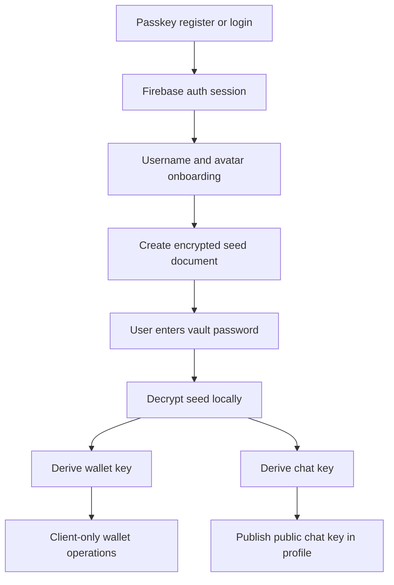
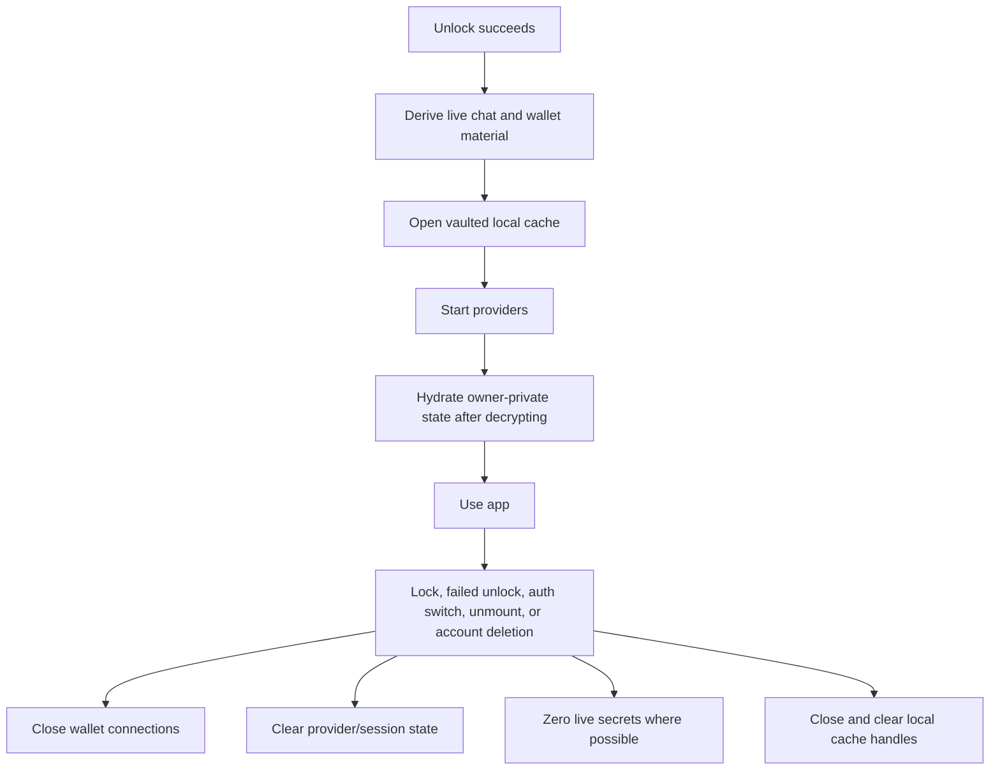
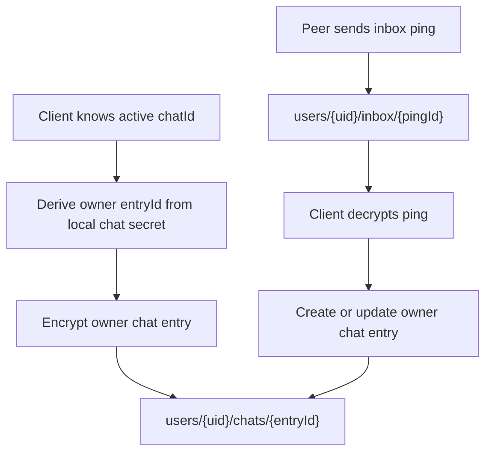
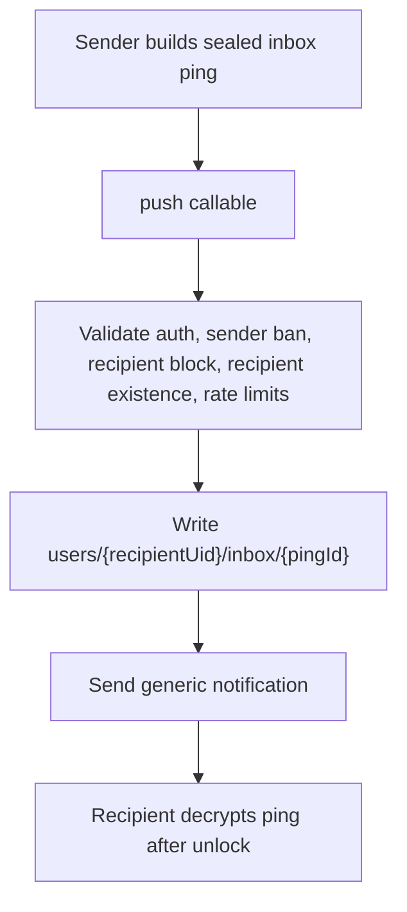
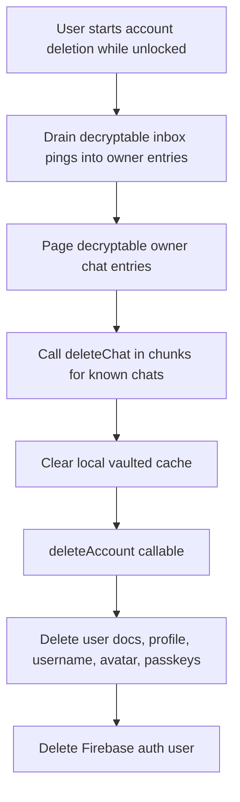

# User Lifecycle

Use this guide when changing account creation, onboarding, vault unlock/lock, local cache lifetime, user-private chat state, push routing, blocking, or account deletion. Chat instance behavior lives in [chat.md](chat.md), message behavior lives in [msg.md](msg.md), and session behavior lives in [session.md](session.md).

## Account And Vault

The user account is company-wide, while wallet/chat secrets live in the local vault.

Glyphteck stores encrypted app data and public profile metadata. Vault password, decrypted seed, wallet secrets, chat private keys, and derived local cache keys stay client-side.

## Unlock And Lock

Unlock creates live capabilities; lock tears them down.

Durable local cache must contain only ciphertext plus nonsensitive envelope metadata while locked. Chat ids, public keys, usernames, message previews, transaction amounts, peer lists, media paths, file keys, filenames, captions, and media metadata do not belong in plaintext durable cache keys or filenames.

## Owner-Private Chat State

Owner-private chat state is stored under the user path and encrypted before storage.

Owner entries are the chat-list source. Inbox pings are sealed 21-day delivery pointers, not duplicated message content.

## Push And Private Routing

Push delivery is the one normal chat path that still needs recipient-specific backend routing.

The backend can know sender auth uid and recipient uid for push routing. It must not receive plaintext message content, chat previews, read state, reaction state, retention state, payment state, or hidden state.

## Account Deletion

Account deletion is client-assisted while the vault is still unlocked because the backend cannot discover encrypted chat membership by itself.

Account deletion waits for known chats to be marked deleted, not for every physical chat cleanup to finish. Scheduled cleanup retries pending chat message and media deletion.

## Ownership

- Auth and onboarding: web/iOS auth routes, passkey modules, profile/user providers.
- Vault boot/lock/cache: `shared/vault.js`, `shared/cache/localdata.js`, platform cache implementations.
- Owner chat entries and inbox pings: `shared/chat/entry.js`, `shared/chat/ping.js`, `shared/providers/chatprovider.js`.
- Push routing: `functions/chat/push.js`.
- Account deletion orchestration: `shared/chat/actions/delete.js`, `functions/user/actions/deleteaccount.js`, `functions/chat/deletechat.js`.
